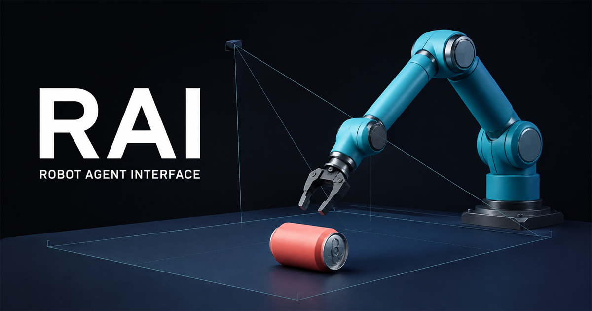
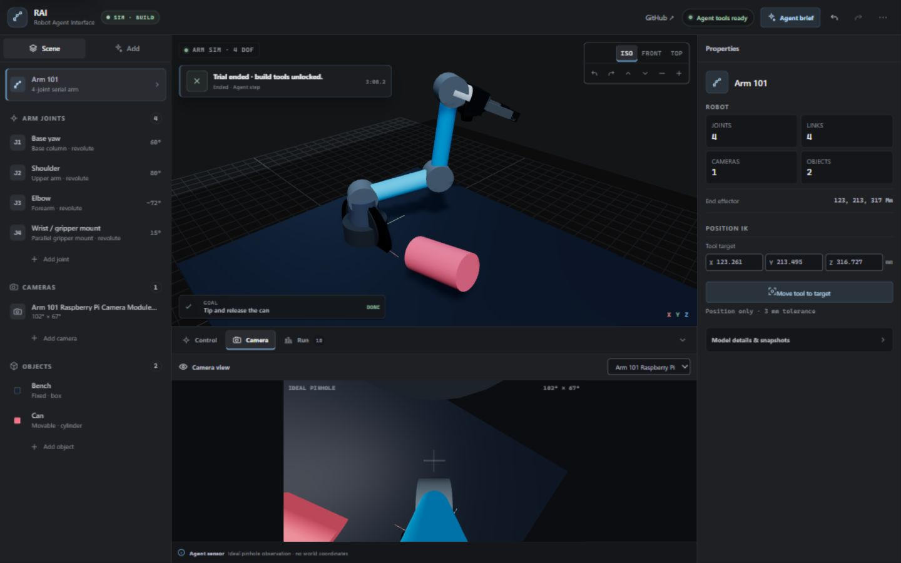
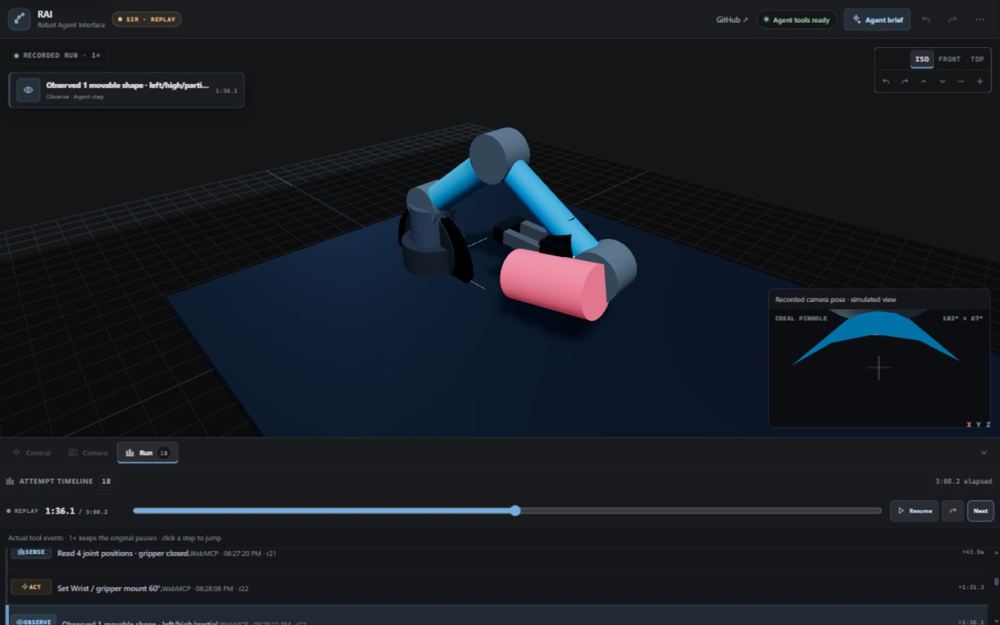
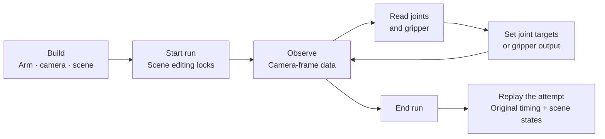

# RAI

Robot Agent Interface. Build an arm in your browser, give an AI its controls, and watch what it actually does.

[Open the website](https://arm-lab-camera-robot.overtt.chatgpt.site) · [Set up with AI](https://arm-lab-camera-robot.overtt.chatgpt.site/?setup=1) · [Tool reference](WEBMCP_TOOLS.md)



*Concept render. The screenshots below show the actual app.*

## Why I made this

I wanted to watch an agent do more than describe a robot move. Let it build an arm, put a camera on it, prepare a scene, and try something. Then make the attempt visible: what it observed, which controls it used, how long it waited, and what happened next.

The important bit is the boundary. While building, the agent can inspect and edit the scene. Once a run starts, it loses that map. It gets camera-frame observations and joint telemetry, and can send joint and gripper outputs. There is no `tip_the_can` function.

Arm 101 is the starter scene, not the whole idea.

## Have a look



Use the controls yourself, or choose **Set up with AI** to bring a compatible WebMCP agent to the page. Human controls and agent tools use the same validated command path.



**Run** shows the recorded attempt, not a canned animation. Replay preserves the original wall-clock pauses at 1×. Click a step or use **Next** to inspect a moment. The camera inset follows the recorded arm pose. Recordings stay in that browser; a fresh browser starts empty.

## How it works



The page exposes 19 WebMCP tools. During a run, only these four work:

| Tool | What the agent gets or does |
| --- | --- |
| `observe_arm_camera` | Structured camera-frame observations; no world coordinates |
| `get_arm_telemetry` | Joint positions, limits, and gripper state |
| `set_arm_outputs` | Bounded joint targets and open/close gripper commands |
| `end_arm_trial` | Ends the attempt and unlocks Build mode |

The other 15 return `PHASE_LOCKED`, including scene reads, inverse kinematics, and named-object grasping. [Full contract](WEBMCP_TOOLS.md).

## What you can build without changing code

- Serial arms with 1–8 joints: fixed, revolute, continuous, or prismatic.
- Different link lengths, directions, radii, joint axes, limits, and base poses.
- Mounted or world cameras with adjustable field of view and clipping range.
- Scenes made from boxes, cylinders, spheres, and planes.
- Joint sequences, task goals, saved snapshots, and JSON projects.

Arm 101 includes a simple parallel gripper. Camera references include Raspberry Pi Camera Module 3 Standard/Wide, OAK-D Lite, and generic pinhole. These are simplified references, not vendor-accurate digital twins. Primitive-visual URDF export is available in the human interface.

## Run locally

You need Git and Node.js `^20.19.0 || >=22.12.0`. No API key, backend, or physical robot is needed.

```sh
git clone https://github.com/over-TT/RAI.git
cd RAI
npm ci
npm run dev
```

Open the URL Vite prints, normally `http://127.0.0.1:4176`. Add `/#workbench` to skip the home screen.

```sh
npm run check
```

That runs TypeScript, tests, and the production build. GitHub Actions runs the same gate. The public website is hosted on ChatGPT Sites.

## Let an agent set it up

**[Open the setup handoff](https://arm-lab-camera-robot.overtt.chatgpt.site/?setup=1)** for a prepared ChatGPT prompt and an option to open the website beside a desktop chat. The link does not auto-send a message or grant tool access.

For repository work, start with [AGENTS.md](AGENTS.md), then follow [the full setup guide](docs/SETUP_WITH_AGENTS.md). It covers installation, discovery, Build, a constrained run, replay, and common failures.

Ordinary ChatGPT web chat is not automatically connected to this page. Check the current [official OpenAI Site Tools guide](https://learn.chatgpt.com/docs/webmcp).

## What this proves—and what it doesn't

RAI is a small research workbench, not an Isaac Sim replacement.

- Motion uses deterministic kinematics. There is no gravity, contact-force, friction, torque, or grasp-stability solver.
- The gripper captures nearby eligible primitives within a fixed 45 mm surface-clearance envelope. It carries them rigidly; released objects remain at their simulated pose.
- The agent receives analytic ideal-pinhole detections, not rendered pixels or learned vision. The visible camera follows the published +Y-image-right convention; it is not a physical camera stream.
- Replay stores tool-event timing and scene snapshots, not video or hidden reasoning. Up to six runs and 120 events per run are retained locally.
- No Raspberry Pi connection or real servo motion happens here.

The [evidence log](NATIVE_WEBMCP_EVIDENCE.md) separates automated tests, local native-WebMCP attempts, and hosted checks. Previous local trials include a can tip/release and a 12-seed sweep; these are simulation results. [Screenshot provenance](docs/media/README.md).

## Challenge material

[Research](HACKATHON_RESEARCH.md) · [Criteria map](HACKATHON_SCORECARD.md) · [Submission checklist](SUBMISSION.md) · [Demo script](submission-assets/README.md) · [New-work provenance](NEW_WORK.md)

[MIT license](LICENSE).

---

[Open RAI](https://arm-lab-camera-robot.overtt.chatgpt.site) · [Open ChatGPT + setup brief](https://arm-lab-camera-robot.overtt.chatgpt.site/?setup=1) · [Agent setup guide](docs/SETUP_WITH_AGENTS.md)
